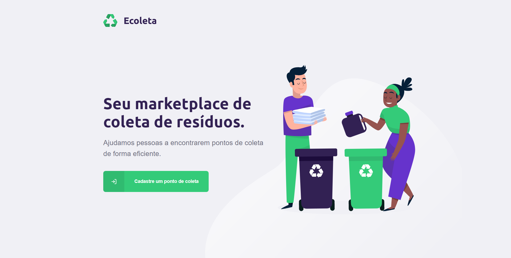
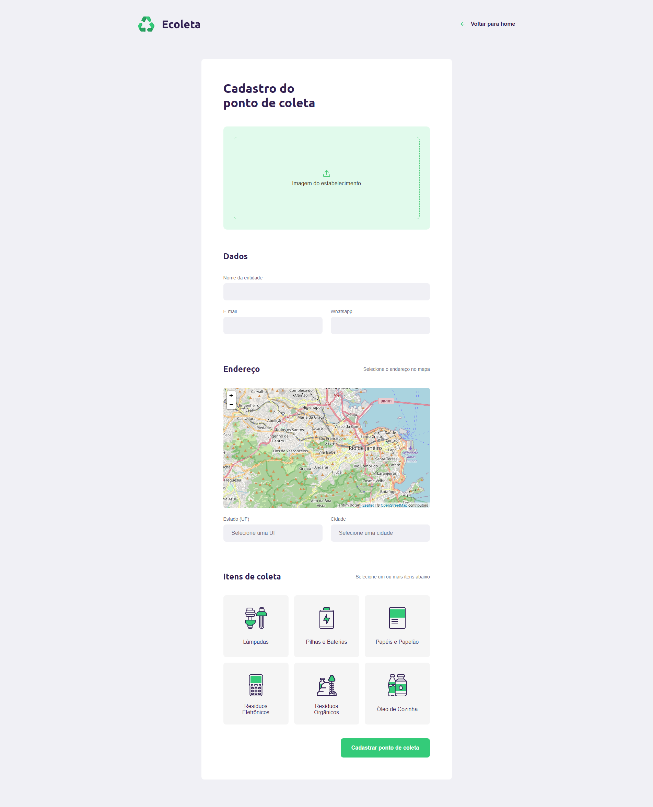
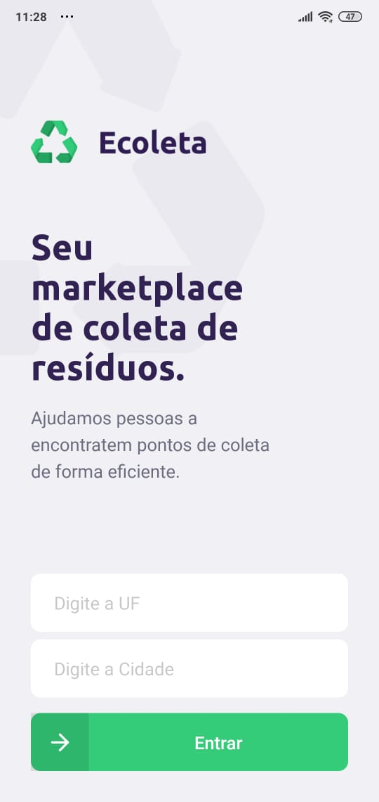
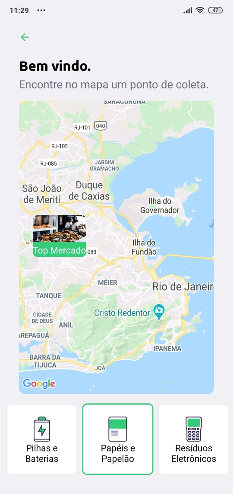

# Next Level Week Rocketseat

<h1 align="center">
    
</h1>
<h2 align="center">
  
  
  
</h2>

  

  
  
  
  
	
  

  

## 💻 Projeto

O projeto, chamado Ecoleta, é um projeto desenvolvido basedo na semana internacional do meio ambiente. Possibilitando encontrar uma forma de conectar pessoas à empresas que coletam resíduos que não devem ser descartados no meio ambiente (Pilhas e baterias, óleo de cozinha etc...).

## 📷 Imagens

### 🖥️ Desktop

<h1 align="center">
    
</h1>

<h1 align="center">
    
</h1>

### 📱 Mobile

    
    

## 🚀 Tecnologias utilizadas

Em relação ao layout, foi utilizado o [Figma](https://www.figma.com/file/1SxgOMojOB2zYT0Mdk28lB/) para sua concepção.

Esse projeto foi desenvolvido com as seguintes tecnologias:

- [Node.js](https://nodejs.org/en/)
- [React](https://reactjs.org)
- [React Native](https://facebook.github.io/react-native/)
- [TypeScript][typescript]
- [Expo](https://expo.io/)
- [Knex][knex]
- [Express][express]

---

Feito com 💜 por Victor Franklin
